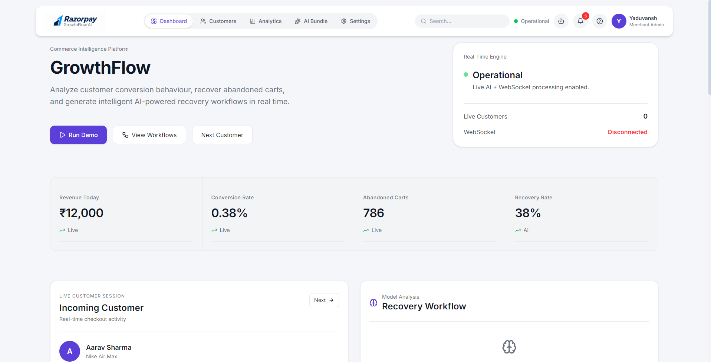

# GrowthFlow AI

> **AI-Powered Commerce Operations Platform for Customer Recovery and Revenue Growth**

GrowthFlow AI is a modern full-stack commerce platform that helps merchants identify high-intent customers, recover abandoned carts, generate AI-powered campaigns, and create Razorpay checkouts through an intelligent merchant copilot.

Built for the **Razorpay × Schneider Electric Hackathon**, GrowthFlow AI combines a premium enterprise dashboard with conversational AI, real-time analytics, and explainable decision-making workflows.

---

## Dashboard Preview

> Replace these placeholders with your actual screenshots before submitting.

| Dashboard |
|-----------|
|  |

---

# Overview

Online merchants lose significant revenue due to abandoned carts and missed customer engagement opportunities. GrowthFlow AI addresses this challenge by analyzing customer behavior, predicting purchase intent, and generating actionable recommendations that help merchants improve conversion rates while keeping every financial action transparent and merchant-approved.

The platform combines:

- AI-powered customer intelligence
- Conversational Merchant Copilot
- Real-time merchant analytics
- Approval-based AI workflows
- Explainable Audit Trail
- Razorpay Test Mode checkout generation
- Offline AI fallback for uninterrupted merchant operations

---

# Problem Statement

Merchants often struggle with:

- Abandoned carts leading to lost revenue
- Generic recovery campaigns with low conversion rates
- Lack of real-time customer insights
- Fragmented merchant tools
- Limited visibility into AI-generated decisions

GrowthFlow AI transforms customer behavior into actionable recovery strategies while ensuring merchants remain in control of financial actions.

---

# Features

## AI Customer Intelligence

- Purchase intent prediction
- Customer behavior analysis
- Cart abandonment detection
- Recovery strategy recommendations
- Personalized customer messaging
- Confidence scoring
- Explainable AI reasoning

---

## Merchant Copilot

A conversational AI assistant powered by **Groq GPT-OSS-20B** that helps merchants:

- Understand customer behavior
- Generate recovery campaigns
- Recommend product bundles
- Create checkout workflows
- Answer business questions naturally
- Continue operating through Offline Intelligence Mode

---

## Live Commerce Dashboard

- Real-time KPI monitoring
- Revenue analytics
- Customer activity feed
- Live WebSocket updates
- Enterprise SaaS interface
- Responsive design
- Razorpay-inspired UI

---

## Merchant Operations

- Customer management
- Customer search and filtering
- Demo Mode for presentations
- Profile management
- Billing dashboard
- Session management
- Approval Gate for AI actions

---

# AI Workflow

```text
Customer Session
       │
       ▼
Intent Analysis
       │
       ▼
AI Recommendation
       │
       ▼
Approval Gate
       │
       ▼
Razorpay Checkout
       │
       ▼
Audit Trail
```

Every important AI decision is recorded, making financial actions transparent and explainable.

---

# Tech Stack

| Layer | Technology |
|--------|------------|
| **Frontend** | React, Vite, Tailwind CSS, React Router |
| **Backend** | FastAPI, Python, Uvicorn |
| **Database** | MySQL |
| **AI** | Groq GPT-OSS-20B |
| **Payments** | Razorpay Test Mode |
| **Live Updates** | WebSockets |
| **Charts** | Recharts |
| **Icons** | Lucide React |

---

# Project Structure

```text
growthflow-ai/
│
├── backend/
│   ├── main.py
│   ├── ai.py
│   ├── audit.py
│   ├── live_engine.py
│   ├── socket_manager.py
│   ├── models.py
│   ├── database.py
│   ├── copilot_service.py
│   ├── requirements.txt
│   └── .env
│
├── frontend/
│   ├── src/
│   │   ├── assets/
│   │   ├── components/
│   │   ├── pages/
│   │   ├── services/
│   │   ├── hooks/
│   │   ├── App.jsx
│   │   └── main.jsx
│   ├── package.json
│   └── vite.config.js
│
├── README.md
└── .gitignore
```

---

# System Architecture

```text
                   Merchant Dashboard (React + Vite)
                            │
                            ▼
                 FastAPI Backend (REST + WebSocket)
                            │
       ┌────────────────────┼────────────────────┐
       ▼                    ▼                    ▼
   MySQL Database        Groq AI            WebSocket Engine
(Customers, Revenue)  Merchant Copilot     Live Dashboard
       │                    │                    │
       └──────────────┬─────┴──────────────┬─────┘
                      ▼                    ▼
               AI Approval Gate      Audit Trail
                      │
                      ▼
           Razorpay Test Mode Checkout
```

---

# Dashboard Modules

## Commerce Overview

Displays live merchant metrics including:

- Revenue Today
- Conversion Rate
- Abandoned Carts
- Recovery Rate
- Live Customer Activity

Powered by **WebSockets** for real-time updates.

---

## Customer Intelligence

Analyze:

- Cart Value
- Time Spent
- Coupon Usage
- Purchase Intent
- Recovery Probability

Generate:

- Recovery Plans
- Personalized Messages
- Discount Recommendations
- Free Shipping Offers

---

## AI Approval Gate

GrowthFlow follows a **human-in-the-loop** approach.

Instead of automatically executing financial actions, AI recommendations require merchant approval.

Supported approvals include:

- WhatsApp recovery campaigns
- Checkout generation
- Promotional recommendations

This keeps AI actions **bounded and merchant-controlled**.

---

## Explainable Audit Trail

Every important action is recorded.

Example timeline:

| Time | Action |
|------|---------|
| 12:42 PM | Customer abandoned ₹4,999 cart |
| 12:43 PM | AI predicted 88% recovery |
| 12:44 PM | Merchant approved campaign |
| 12:45 PM | Razorpay checkout generated |
| 12:46 PM | Payment completed |

This satisfies the hackathon requirement of making money actions explainable.

---

# API Endpoints

## Dashboard

```http
GET /dashboard
```

Returns live merchant metrics.

---

## Customers

```http
GET /customers
```

Returns customer records.

---

## Analyze Customer

```http
POST /analyze
```

### Request

```json
{
  "cart_value": 4999,
  "time_spent": 780,
  "coupon_used": false
}
```

### Response

```json
{
  "intent": {
    "intent": "High Purchase Intent",
    "confidence": 92
  },
  "offer": {
    "offer": "10% Discount"
  },
  "recovery": {
    "probability": 88
  },
  "message": {
    "message": "Complete your purchase today and save instantly."
  }
}
```

---

## Merchant Copilot

```http
POST /copilot/chat
```

Provides conversational AI assistance.

---

## Audit Trail

```http
GET /audit
```

Returns AI activity logs.

---

## Approval Gate

```http
GET /approvals
POST /approvals/respond
```

Handles merchant approval workflows.

---

## Live Dashboard

```http
GET /ws/dashboard
```

WebSocket endpoint for real-time updates.

---

# Installation

## Clone Repository

```bash
git clone https://github.com/YOUR_USERNAME/growthflow-ai.git

cd growthflow-ai
```

---

## Backend Setup

Create a virtual environment.

```bash
python -m venv venv
```

### Windows

```bash
venv\Scripts\activate
```

### macOS/Linux

```bash
source venv/bin/activate
```

Install dependencies.

```bash
pip install -r requirements.txt
```

Create `.env`.

```env
GROQ_API_KEY=your_api_key_here
```

Run backend.

```bash
uvicorn main:app --reload
```

Backend runs at:

```text
http://localhost:8000
```

---

## Frontend Setup

Install dependencies.

```bash
npm install
```

Run development server.

```bash
npm run dev
```

Frontend runs at:

```text
http://localhost:5173
```

---

# Demo Flow

1. Customer enters the dashboard.
2. AI predicts recovery probability.
3. Merchant requests a recovery campaign.
4. Approval card appears.
5. Merchant approves.
6. WhatsApp campaign is generated.
7. Razorpay checkout is created.
8. Revenue updates live.
9. Audit Trail explains every action.

---

# Current Capabilities

- AI Customer Analysis
- Intent Prediction
- Bundle Recommendations
- Merchant Copilot
- WhatsApp Recovery Campaigns
- Razorpay Test Checkout
- Live Customer Feed
- Revenue Dashboard
- WebSocket Updates
- AI Approval Gate
- Explainable Audit Trail
- Offline Intelligence Mode
- Enterprise SaaS UI
- Responsive Design

---

# Graceful Failure Handling

GrowthFlow AI includes an **Offline Intelligence Mode**.

If Groq becomes unavailable:

- Bundle recommendations continue.
- Recovery campaigns remain available.
- Checkout generation still works.
- Revenue insights continue.
- Audit Trail records the fallback.

This ensures merchants can continue operating even during AI service interruptions.

---

# Future Enhancements

- Multi-merchant authentication
- Persistent AI conversation history
- Inventory-aware recommendations
- Email campaign generation
- Production Razorpay APIs
- Analytics export (CSV/PDF)
- Team collaboration
- Role-based permissions

---

# Learning Outcomes

This project demonstrates practical experience with:

- Full-stack application development
- FastAPI REST API design
- React state management
- Component-driven architecture
- WebSocket communication
- MySQL database integration
- AI integration with Groq
- Enterprise SaaS dashboard development
- Explainable AI workflows
- Human-in-the-loop approval systems
- Responsive UI engineering

---

# Why GrowthFlow AI?

Most AI projects stop at building chatbots.

GrowthFlow AI demonstrates how conversational AI can become a practical business tool by helping merchants recover abandoned carts, optimize conversions, and automate customer engagement through a production-style commerce operations platform.

The goal was to build something that feels like a real SaaS product rather than a simple AI demo.

---

# Author

## Yaduvansh Tyagi

Software Engineering Student

**Tech Stack:** React • FastAPI • Python • MySQL • Groq AI • Razorpay Test Mode • Tailwind CSS • Full Stack Development

---

# License

This project is intended for educational, research, and portfolio purposes.

Built for the **Razorpay × Schneider Electric Hackathon**.
